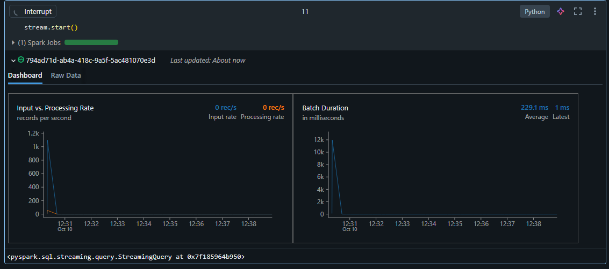

# Meu Lago Mago 🪄

## Visão Geral

Este projeto constrói um **Data Lakehouse** do zero no Databricks, seguindo as melhores práticas de engenharia de dados. Inspirado na playlist **"Lago do Mago"** de Téo Me Why, implementamos uma arquitetura em camadas (Bronze, Silver, Gold) com integração entre **CDC (Change Data Capture)** e **Full Load**, utilizando o ecossistema Databricks para processamento de dados em larga escala.

O foco atual está na **camada Bronze**, responsável pela ingestão e armazenamento bruto dos dados, preparando o terreno para transformações nas camadas superiores.

## Arquitetura do Lakehouse

A arquitetura segue o modelo tradicional de Lakehouse:

- **Bronze Layer**: Dados brutos ingeridos diretamente das fontes, com mínimo processamento. Armazenamento em Delta Lake para versionamento e ACID transactions.
- **Silver Layer**: Dados limpos e transformados, prontos para análise.
- **Gold Layer**: Dados agregados e otimizados para consumo por aplicações e dashboards.

Fluxo atual (até Aula 02): `clientes` → `transacao` (ingestão sequencial com dependências via Lakeflow Jobs).

## Etapas Concluídas (Até Aula 02)

✅ **Configuração do Ambiente**
- Setup do workspace Databricks com Unity Catalog para governança de dados.
- Integração com repositório GitHub (`meu-lago-mago`) para versionamento de código.

✅ **Estrutura de Pastas**
- Organização inicial: `src/bronze/ingestao/`.
- Notebooks desenvolvidos: `bronze_clientes.ipynb` e `bronze_transacao.ipynb`.

✅ **Desenvolvimento dos Notebooks Bronze**
- `bronze_clientes`: Ingestão de dados de clientes via Full Load.
- `bronze_transacao`: Ingestão de dados de transações via CDC, com merge incremental.

✅ **Orquestração com Lakeflow Jobs**
- Criação de jobs no Databricks para execução automatizada.
- Dependência sequencial: `bronze_clientes` executa antes de `bronze_transacao` para evitar conflitos de concorrência.

✅ **Tratamento de Erros e Otimizações**
- Resolução de `ConcurrentAppendException` através de execução sequencial.
- Implementação de controle transacional Delta para merges seguros.

## Pipeline de Execução

A imagem mostra a execução do Lakeflow Job no Databricks, responsável pela orquestração das tabelas da camada Bronze do projeto meu-lago-mago. O fluxo de tarefas é sequencial, representando o processo de ingestão e consolidação de dados com controle de dependência entre tabelas.

- **bronze_clientes** → Primeira tarefa do pipeline, encarregada de processar e aplicar o merge CDC dos dados de clientes na camada Bronze.
- **bronze_transacao** → Executada automaticamente após a conclusão da etapa anterior, realiza o merge CDC das transações, garantindo a consistência e integridade referencial entre entidades.

Cada bloco verde indica execução bem-sucedida no Cluster de Tiago Silva, e a seta entre as tarefas evidencia a dependência de execução: a segunda inicia apenas quando a primeira finaliza com sucesso. Esse mecanismo previne conflitos de escrita no Delta Lake (como o ConcurrentAppendException) e assegura que os merges ocorram em ordem controlada.

📈 Essa execução confirma a estabilidade do pipeline de ingestão e valida a estrutura transacional da camada Bronze dentro do Lakehouse.

## Tecnologias e Ferramentas

- 🏗️ **Databricks**: Plataforma para processamento de big data e machine learning.
- 🏞️ **Delta Lake**: Formato de armazenamento com ACID transactions e versionamento.
- ⚡ **PySpark**: API Python para Apache Spark, usada para processamento distribuído.
- 📚 **Unity Catalog**: Sistema de governança para metadados e controle de acesso.
- 🐙 **GitHub**: Controle de versão e colaboração.
- 🔄 **Lakeflow Jobs**: Orquestração de pipelines no Databricks.

## Próximos Passos

🚀 **Aula 03 em diante**: Expansão para camadas Silver e Gold.
- Transformações e limpeza de dados na Silver Layer.
- Agregações e modelagem dimensional na Gold Layer.
- Integração avançada de CDC e otimização de performance.
- Implementação de dashboards e relatórios finais.

## Aula 3 — CDC com streaming

Nesta aula implementamos ingestão contínua de eventos CDC (Change Data Capture) usando Structured Streaming do Spark para manter a camada Bronze atualizada em tempo quase real.

- Abordagem:
	- Ler arquivos CDC (Parquet/JSON) como stream com `spark.readStream`.
	- Usar um schema explícito capturado a partir de amostras para evitar inferência dinâmica.
	- Gravar em Delta Lake com `checkpointLocation` para garantir consistência entre execuções.
	- Aplicar merges incrementais em tabelas Bronze para refletir inserts/updates/deletes.

- Notebooks relacionados:
	- `src/bronze/ingestao.ipynb` — contém a implementação do streaming (captura de schema, leitura via `spark.readStream`, checkpoint e `writeStream`).
	- `src/bronze/bronze_transacao.ipynb` — adaptações para merges a partir de eventos CDC.

- Como executar (resumo):
	1. Preparar a pasta de raw CDC (ex.: `/mnt/raw/cdc/<tabela>/`) com arquivos de eventos.
	2. Ajustar variáveis de caminho e nomes de tabela no notebook.
	3. Executar a célula que inicia o stream (`stream.start()`) no Databricks.
	4. Monitorar o progresso no UI de Streaming do Databricks e validar escrita em Delta.

- Observações e recomendações:
	- Defina `checkpointLocation` em storage persistente (ADLS/S3) para recuperação correta.
	- Ajuste `maxFilesPerTrigger` / `trigger` para balancear latência e throughput.
	- Para operações de delete no CDC, trate tombstones ou implemente lógica de soft-delete antes do merge.
	- Use orquestração (Lakeflow Jobs) para evitar conflitos de escrita e gerenciar dependências.

## Créditos e Referências

Este projeto é baseado na playlist **"Lago do Mago"** de **Téo Me Why**, disponível no YouTube. Agradecimentos especiais ao criador por compartilhar conhecimentos valiosos sobre engenharia de dados no Databricks.

🔗 [Playlist Lago do Mago - YouTube](https://www.youtube.com/playlist?list=PLvlkVRRKOYFTcLehYZ2Bd5hGIcLH0dJHE)

GitHub: [@TeoMeWhy](https://github.com/TeoMeWhy)

## Autores e Contribuições

- **Tiago Silva** (@tmarsbr) - Desenvolvedor principal e implementador do projeto no Databricks.
- **Teo Calvo** (@TeoCalvo) - Criador da playlist "Lago do Mago" e fonte de inspiração para as melhores práticas de engenharia de dados.

---

*Projeto desenvolvido com dedicação para aprendizado e aplicação prática de conceitos de Data Lakehouse. 🧙‍♂️*
